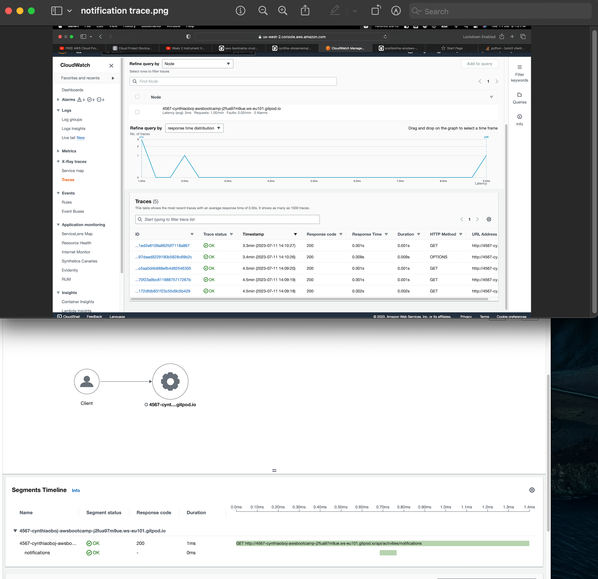

# Week 2 — Distributed Tracing

## #1 HONEYCOMB SETUP
Create an account with Honeycomb via https://ui.honeycomb.io/


## Required Homework

```
- Observer and understanding of the use of Honeycomb, which is an application used for logging and tracing data. Also used OTEL-Open 
  Telemetry open source observability framework with Honeycomb to instrument traces and logs.
- Instrument Honeycomb for the fronted application to observe network latency between frontend and backend
- Add custom Instrumentation to honeycomb to add more attributes eg UserID and a custom span
- Run custom queries in Honeycomb and save them later eg latency by UserID


```

*** SETUP HONEYCOMB ENV on the environment

```
export HONEYCOMB_API_KEY="
export HONEYCOMB_SERVICE_NAME="Cruddur"
```
- a. create opentelement (OTEL ENV)Honeycomb for the back-end on docker compose.yml
```
      OTEL_SERVICE_NAME: 'backend-flask'
      OTEL_EXPORTER_OTLP_ENDPOINT: "https://api.honeycomb.io"
      OTEL_EXPORTER_OTLP_HEADERS: "x-honeycomb-team=${HONEYCOMB_API_KEY}" 
````
- b. ADD The DEPENDENCES TO The requiremnt.txt for the opentelemetry installation
```
opentelemetry-api 
opentelemetry-sdk 
opentelemetry-exporter-otlp-proto-http 
opentelemetry-instrumentation-flask 
opentelemetry-instrumentation-requests

```

-- c. ADD to app.py

```
# Honeycomb ----
from opentelemetry import trace
from opentelemetry.instrumentation.flask import FlaskInstrumentor
from opentelemetry.instrumentation.requests import RequestsInstrumentor
from opentelemetry.exporter.otlp.proto.http.trace_exporter import OTLPSpanExporter
from opentelemetry.sdk.trace import TracerProvider
from opentelemetry.sdk.trace.export import BatchSpanProcessor

# Initialize tracing and an exporter that can send data to Honeycomb
provider = TracerProvider()
processor = BatchSpanProcessor(OTLPSpanExporter())
provider.add_span_processor(processor)
trace.set_tracer_provider(provider)
tracer = trace.get_tracer(__name__)

app = Flask(__name__)
# Initialize automatic instrumentation with Flask
FlaskInstrumentor().instrument_app(app)
RequestsInstrumentor().instrument()

```


```
from open telemetry import trace


tracer = trace.get_tracer("home.activities")

       
class HomeActivities:
  def run():
    with tracer.start_as_current_span("home-activities-mock-data"):
 ```

## 
  

## #2 AWS XRAY SETUP

-- Run the AWS xray via the terminal using the below command to get started.
```
pip install aws-xray-sdk

AND add the above code to the backend requirement file
```

- add the x-ray middleware setup on `app.py`
```
# xray
from aws_xray_sdk.core import xray_recorder
from aws_xray_sdk.ext.flask.middleware import XRayMiddleware
xray_url = os.getenv("AWS_XRAY_URL")
xray_recorder.configure(service='Cruddur', dynamic_naming=xray_url)
XRayMiddleware(app, xray_recorder)
```

-- Create a Sampling Rule name 'Backend-flask'. This code is to be written in a new  `aws/json/xray.json` file
```
{
  "SamplingRule": {
      "RuleName": "Cruddur",
      "ResourceARN": "*",
      "Priority": 9000,
      "FixedRate": 0.1,
      "ReservoirSize": 5,
      "ServiceName": "Cruddur",
      "ServiceType": "*",
      "Host": "*",
      "HTTPMethod": "*",
      "URLPath": "*",
      "Version": 1
  }
}
```

-- Create a new group for tracing and analyzing errors and faults in a Flask application.
```
aws xray create-group \
   --group-name "Cruddurr" \
   --filter-expression "service(\"backend-flask\")"
```
** The x-ray group can be viewed on the AWS console via the setting on the Cloudwatch page.

-- Create a simple rule on the CLI 
```
aws xray create-sampling-rule --cli-input-json file://aws/json/xray.json
```


- **Install Daemon Service**
```
-- Add the below code to the docker-compose.yml for the X-ray daemon
 xray-daemon:
    image: "amazon/aws-xray-daemon"
    environment:
      AWS_ACCESS_KEY_ID: "${AWS_ACCESS_KEY_ID}"
      AWS_SECRET_ACCESS_KEY: "${AWS_SECRET_ACCESS_KEY}"
      AWS_REGION: "us-west-2"
    command:
      - "xray -o -b xray-daemon:2000"
    ports:
      - 2000:2000/udp
```

--We need to add these two env vars to our backend-flask in our docker-compose.yml file

```
AWS_XRAY_URL: "*4567-${GITPOD_WORKSPACE_ID}.${GITPOD_WORKSPACE_CLUSTER_HOST}*"
      AWS_XRAY_DAEMON_ADDRESS: "xray-daemon:2000"
```
OR ( for codespaces)

```
AWS_XRAY_URL: "*4567-${CODESPACE_NAME}-4567.${GITHUB_CODESPACES_PORT_FORWARDING_DOMAIN}*"
      AWS_XRAY_DAEMON_ADDRESS: "xray-daemon:2000"
```

After adding I got subsegments 


## Setup AWS X-RA Custom segment

- I setup a segment to capture data from the `notification_activities.py`

import xray recorder to the notification_activities.py
```
from aws_xray_sdk.core import xray_recorder
```
** setup the segment to capture data from the notification page
```


```
- After adding I got subsegments in the notification section
  



## #3 ROLLBAR SETUP
** 1. add blinker, rollbar to the backend requirements.txt list

** 2. cd into the backend and install the backend dependecncies.
```
pip install -r requirements.txt
```
** 3. Add the rollbar access token.
```
export ROLLBAR_ACCESS_TOKEN="d******************"
gp env ROLLBAR_ACCESS_TOKEN="d******************"
```
** 4. Install rollbar in the backend app.py file
```
import os
import rollbar
import rollbar.contrib.flask
from flask import got_request_exception

rollbar_access_token = os.getenv('ROLLBAR_ACCESS_TOKEN')
#@app.before_first_request --> --> -->
with app.app_context():
  def init_rollbar():
      """init rollbar module"""
      rollbar.init(
          # access token
          rollbar_access_token,
          # environment name
          'production',
          # server root directory, makes tracebacks prettier
          root=os.path.dirname(os.path.realpath(__file__)),
          # flask already sets up logging
          allow_logging_basic_config=False)

      # send exceptions from `app` to rollbar, using flask's signal system.
      got_request_exception.connect(rollbar.contrib.flask.report_exception, app)
```
###Backend Rollbar Error
I was facing poblem while trying to start up the backend container, i got the error captured below from the log. "Attributerror


###Backend Rollbar Solved
I was able to resolve the issue by the solution proposed by one of our bootcamper (KiryuChan)

"Essentially I commented out 
`@app.before_first_request`
 and replaced it with 
`with app.app_context():`
 and then indented the 
`def_init_rollbar():``
 function"