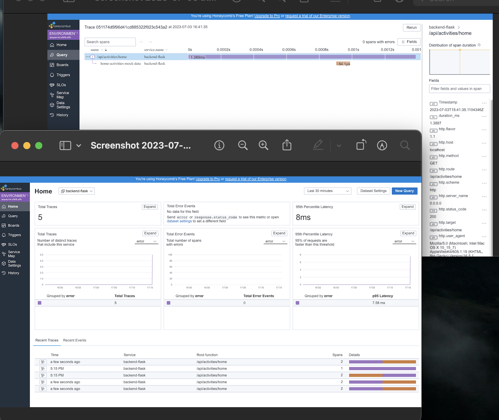

# Week 2 — Distributed Tracing

## #1 HONEYCOMB SETUP
Create an account with Honeycomb via https://ui.honeycomb.io/


## Required Homework

```
- Observer and understanding of the use of Honeycomb, which is an application used for logging and tracing data. Also used OTEL-Open 
  Telemetry open source observability framework with Honeycomb to instrument traces and logs.
- Instrument Honeycomb for the fronted application to observe network latency between frontend and backend
- Add custom Instrumentation to honeycomb to add more attributes eg UserID and a custom span
- Run custom queries in Honeycomb and save them later eg latency by UserID


```

*** SETUP HONEYCOMB ENV on the environment

```
export HONEYCOMB_API_KEY=""
export HONEYCOMB_SERVICE_NAME="Cruddur"
```
- a. create opentelement (OTEL ENV)Honeycomb for the back-end on docker compose.yml
```
      OTEL_SERVICE_NAME: 'backend-flask'
      OTEL_EXPORTER_OTLP_ENDPOINT: "https://api.honeycomb.io"
      OTEL_EXPORTER_OTLP_HEADERS: "x-honeycomb-team=${HONEYCOMB_API_KEY}" 
````
- b. ADD The DEPENDENCES TO The requiremnt.txt for the opentelemetry installation
```
opentelemetry-api 
opentelemetry-sdk 
opentelemetry-exporter-otlp-proto-http 
opentelemetry-instrumentation-flask 
opentelemetry-instrumentation-requests

```

-- c. ADD to app.py

```
# Honeycomb ----
from opentelemetry import trace
from opentelemetry.instrumentation.flask import FlaskInstrumentor
from opentelemetry.instrumentation.requests import RequestsInstrumentor
from opentelemetry.exporter.otlp.proto.http.trace_exporter import OTLPSpanExporter
from opentelemetry.sdk.trace import TracerProvider
from opentelemetry.sdk.trace.export import BatchSpanProcessor

# Initialize tracing and an exporter that can send data to Honeycomb
provider = TracerProvider()
processor = BatchSpanProcessor(OTLPSpanExporter())
provider.add_span_processor(processor)
trace.set_tracer_provider(provider)
tracer = trace.get_tracer(__name__)

app = Flask(__name__)
# Initialize automatic instrumentation with Flask
FlaskInstrumentor().instrument_app(app)
RequestsInstrumentor().instrument()

```




```
from opentelemetry import trace


tracer = trace.get_tracer("home.activities")

       
class HomeActivities:
  def run():
    with tracer.start_as_current_span("home-activities-mock-data"):
 ```

## 
  

## #2 AWS XRAY SETUP

-- To get started, Run the AWS xray via the terminal using the below command.
`
pip install aws-xray-sdk
`


