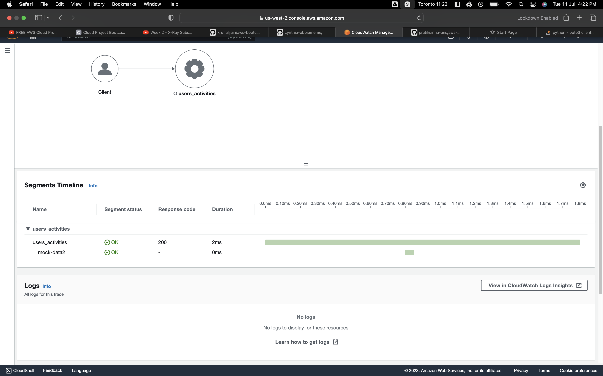

# Week 3 — Decentralized Authentication
## AWS CONGNITO
The process of setting up a congito userpool for login and sign-up management on congito

** Login into the aws console and search for cognito
** Click on the Congito user-pool to setup a new userpool 

** select your preferred user pool sign in  `Username`, `Email`, `phone no` options and user name requirements.
** Configure security requirments and MFA (selected No MFA -> Next) +3 LOL
** Setup User account recovery
** create the Self-service sign-up
** Setup required attributes( like name)
** Configure message delivery
** give your User Pool Name , I gave it as cruddur-pool -> under Initial app client I kept it as Public client -> enter app client name (eg: cruddur) -> Next

### 2. SETUP ON AMPLIFY (GITPOD)

** 1. install Aws Amplify on frontend-react application 
```
npm i aws-amplify --save
```
### 3. CONFIGURE AMPLIFY ON `app.js`
```
import { Amplify } from 'aws-amplify';

Amplify.configure({
  "AWS_PROJECT_REGION": process.env.REACT_AWS_PROJECT_REGION,
  "aws_cognito_identity_pool_id": process.env.REACT_APP_AWS_COGNITO_IDENTITY_POOL_ID,
  "aws_cognito_region": process.env.REACT_APP_AWS_COGNITO_REGION,
  "aws_user_pools_id": process.env.REACT_APP_AWS_USER_POOLS_ID,
  "aws_user_pools_web_client_id": process.env.REACT_APP_CLIENT_ID,
  "oauth": {},
  Auth: {
    // We are not using an Identity Pool
    // identityPoolId: process.env.REACT_APP_IDENTITY_POOL_ID, // REQUIRED - Amazon Cognito Identity Pool ID
    region: process.env.REACT_AWS_PROJECT_REGION,           // REQUIRED - Amazon Cognito Region
    userPoolId: process.env.REACT_APP_AWS_USER_POOLS_ID,         // OPTIONAL - Amazon Cognito User Pool ID
    userPoolWebClientId: process.env.REACT_APP_AWS_USER_POOLS_WEB_CLIENT_ID,   // OPTIONAL - Amazon Cognito Web Client ID (26-char alphanumeric string)
  }
});
```
*** Setup the REACT_APP ENV on docker-compose.yml
```
REACT_APP_AWS_PROJECT_REGION= ""
REACT_APP_AWS_COGNITO_IDENTITY_POOL_ID= ""
REACT_APP_AWS_COGNITO_REGION= ""
REACT_APP_AWS_USER_POOLS_ID= ""
REACT_APP_CLIENT_ID= ""
```

*** Setup Conditionals that allows some components of the apps to show based on logged in or logged out action

Inside our `HomeFeedPage.js`

```
import { Auth } from 'aws-amplify';
 
// set a state
const [user, setUser] = React.useState(null);

// check if we are authenicated
const checkAuth = async () => {
  Auth.currentAuthenticatedUser({
    // Optional, By default is false. 
    // If set to true, this call will send a 
    // request to Cognito to get the latest user data
    bypassCache: false 
  })
  .then((user) => {
    console.log('user',user);
    return Auth.currentAuthenticatedUser()
  }).then((cognito_user) => {
      setUser({
        display_name: cognito_user.attributes.name,
        handle: cognito_user.attributes.preferred_username
      })
  })
  .catch((err) => console.log(err));
};

```

check when the page loads if we are authenicated and catch double api calls
```
React.useEffect(()=>{
  // prevents double api call
  if (dataFetchedRef.current)return;
  dataFetchedRef.current = true;
  loadData();
  checkAuth();
}, [])
```
** Make sure this code is present in the Desktop navigation.js file `if (props.user) 

In the profileInfo.js

Add the below code to `Profileinfor.js` state the key functions like `signout`,

```
import { Auth } from 'aws-amplify';

export default function ProfileInfo(props) {
  const [popped, setPopped] = React.useState(false);

  const click_pop = (event) => {
    setPopped(!popped)
  }

  const signOut = async () => {
    try {
        await Auth.signOut({ global: true });
        window.location.href = "/"
    } catch (error) {
        console.log('error signing out: ', error);
    }
  }
```
### SignIn page

```
import { Auth } from 'aws-amplify';

export default function SigninPage() {

  const [email, setEmail] = React.useState('');
  const [password, setPassword] = React.useState('');
  const [errors, setErrors] = React.useState('');


  const onsubmit = async (event) => {
    setErrors('')
    event.preventDefault();
      Auth.signIn(email, password)
      .then(user => {
        console.log('user',user)
        localStorage.setItem("access_token", user.signInUserSession.accessToken.jwtToken)
        window.location.href = "/"
      })
      .catch(error=> { 
        if (error.code == 'UserNotConfirmedException') {
          window.location.href = "/confirm"
        }
        setErrors(error.message)
    });
    return false
  }
```

### Sign-up page

```
mport { Auth } from 'aws-amplify';

export default function SignupPage() {

  // Username is Eamil
  const [name, setName] = React.useState('');
  const [email, setEmail] = React.useState('');
  const [username, setUsername] = React.useState('');
  const [password, setPassword] = React.useState('');
  const [errors, setErrors] = React.useState('');
  

const onsubmit = async (event) => {
  event.preventDefault();
  setErrors('')
  try {
      const { user } = await Auth.signUp({
        username: email,
        password: password,
        attributes: {
            name: name,
            email: email,
            preferred_username: username,
        },
        autoSignIn: { // optional - enables auto sign in after user is confirmed
            enabled: true,
        }
      });
      console.log(user);
      window.location.href = `/confirm?email=${email}`
  } catch (error) {
      console.log(error);
      setErrors(error.message)
  }
  return false
  }

```
### Confirmation Page

```
// [TODO] Authenication
import { Auth } from 'aws-amplify';

export default function ConfirmationPage() {
  const [email, setEmail] = React.useState('');
  const [code, setCode] = React.useState('');
  const [errors, setErrors] = React.useState('');
  const [codeSent, setCodeSent] = React.useState(false);

  const params = useParams();

  const code_onchange = (event) => {
    setCode(event.target.value);
  }
  const email_onchange = (event) => {
    setEmail(event.target.value);
  }

  const resend_code = async (event) => {
    setErrors('')
    try {
      await Auth.resendSignUp(email);
      console.log('code resent successfully');
      setCodeSent(true)
    } catch (err) {
      // does not return a code
      // does cognito always return english
      // for this to be an okay match?
      console.log(err)
      if (err.message == 'Username cannot be empty'){
        setErrors("You need to provide an email in order to send Resend Activiation Code")   
      } else if (err.message == "Username/client id combination not found."){
        setErrors("Email is invalid or cannot be found.")   
      }
    }
  }

  const onsubmit = async (event) => {
    event.preventDefault();
    setErrors('')
    try {
      await Auth.confirmSignUp(email, code);
      window.location.href = "/"
    } catch (error) {
      setErrors(error.message)
    }
     return false
  }

```
### RECOVERY PAGE

```
mport { Auth } from 'aws-amplify';

export default function RecoverPage() {
  // Username is Eamil
  const [username, setUsername] = React.useState('');
  const [password, setPassword] = React.useState('');
  const [passwordAgain, setPasswordAgain] = React.useState('');
  const [code, setCode] = React.useState('');
  const [errors, setErrors] = React.useState('');
  const [formState, setFormState] = React.useState('send_code');

  const onsubmit_send_code = async (event) => {
    event.preventDefault();
    setErrors('')
    Auth.forgotPassword(username)
    .then((data) => setFormState('confirm_code') )
    .catch((err) => setErrors(err.message) );
    return false
  }
  const onsubmit_confirm_code = async (event) => {
    event.preventDefault();
    setErrors('')
    if (password == passwordAgain){
      Auth.forgotPasswordSubmit(username, code, password)
      .then((data) => setFormState('success'))
      .catch((err) => setErrors(err.message) );
    } else {
      setErrors('Passwords do not match')
    }
    return false
```

### READ TOKEN TO BACKEND_FLASK
```
`from flask import request`

@app.route("/api/activities/home", methods=['GET'])
def data_home():
  print(
    request.headers.get('Authorization')
  )
  data = HomeActivities.run(logger=LOGGER)
  return data, 200
```

### Update CORS in app.py

```
cors = CORS(
  app, 
  resources={r"/api/*": {"origins": origins}},
  headers=['Content-Type', 'Authorization'], 
  expose_headers='Authorization',
  methods="OPTIONS,GET,HEAD,POST"
)
```




### Setup up JWT Token verification for backend-flask

** 